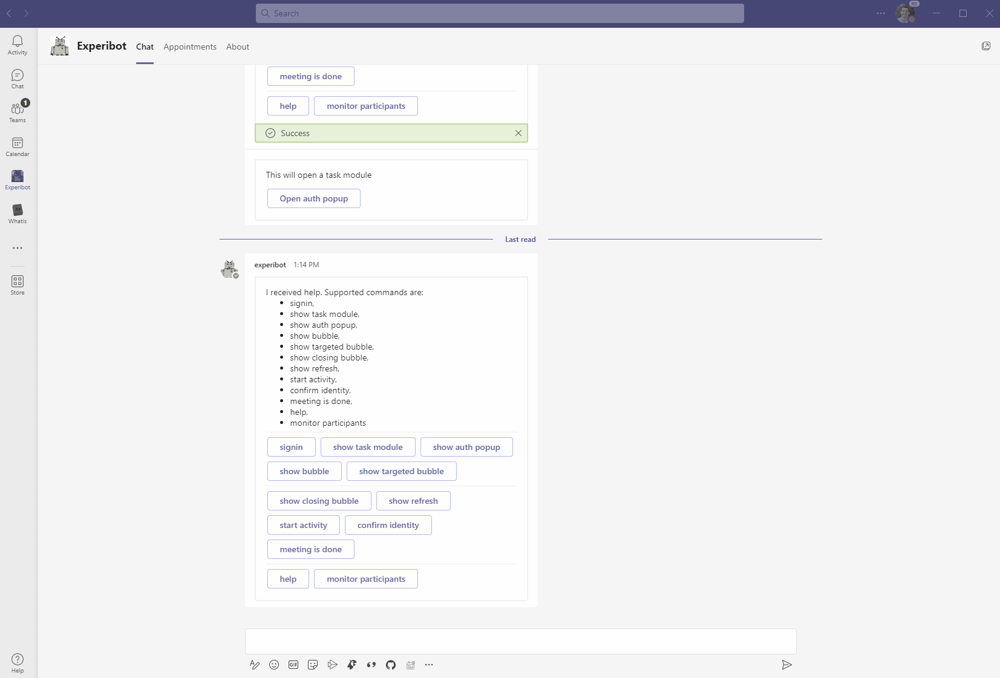
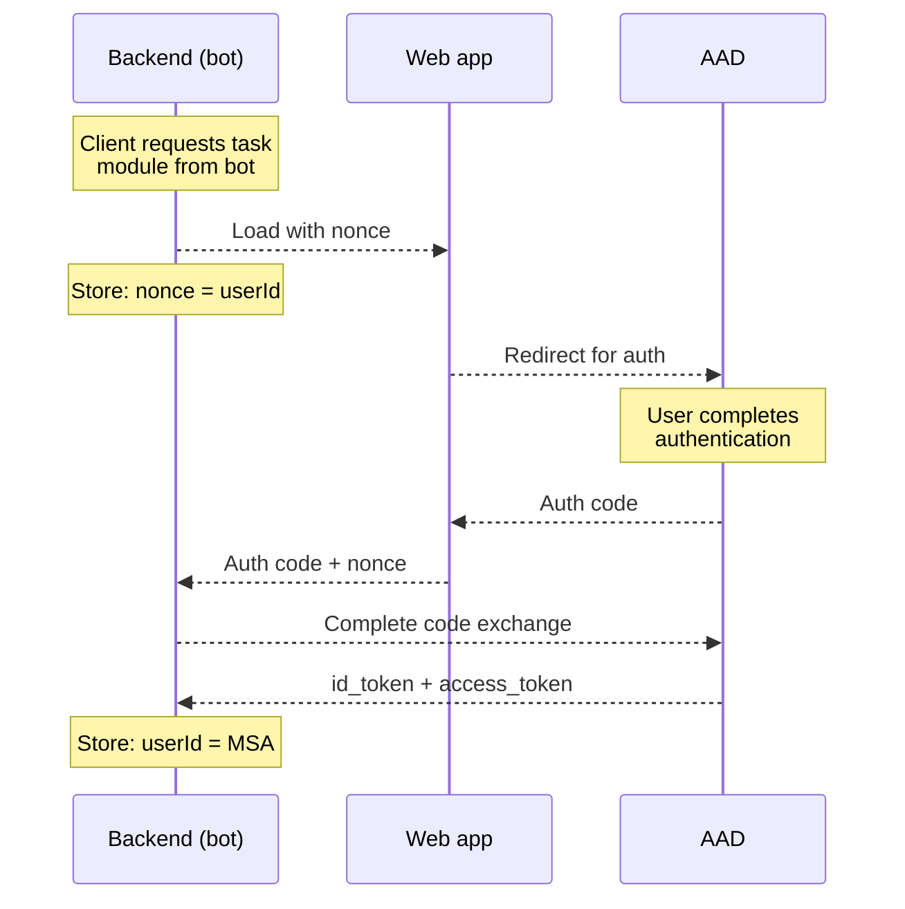

# Auth popup from Adaptive Card



You can open auth popups directly from adaptive cards. Feature is documented [there](https://docs.microsoft.com/en-us/microsoftteams/platform/task-modules-and-cards/cards/cards-actions?tabs=json#action-type-signin). Advantage of doing are:
1. URL is displayed, which gives user the opportunity to validate that the page is not spoofed
2. Page is not rendered in an iFrame.

To do so, the adaptive card action needs to be of type "signin" and specify the URL of page to be loaded.

```
msteams: {
  type: "signin",
  title: "Click me for signin",
  value: "https://rlay.feval.ca/auth/"
},
```


# In-app authentication

This scenario leverages the [authentication popup](https://docs.microsoft.com/en-us/microsoftteams/platform/tabs/how-to/authentication/auth-tab-aad) to authenticate user _in the app_. The point there is to use a person's identity for the app, regardless of what their identity in Teams is. This can be used, for example, to authenticate a person using their MSA if they are connected with a work account, authenticate anonymous users with their MSA without having to add them as guests to a tenant, or authenticate users to any Oauth identity provider (Facebook, Google, etc.)

The mechanism to do so is the following:
1.	When the webpage is returned and authentication is required, a nonce is created in the backend bot and included in that page. Backend bot retains mapping between nonce and anonymous user id.
2.	The lobby webpage handles the authentication flow using the code exchange grant
3.	After successful auth to Azure AD, lobby app receives a callback containing the auth code.
4.	Lobby app calls the backend bot API with the nonce + auth code.
5.	Backend bot calls Azure AD with the auth code and exchange it for id_token and access_token, then maps the user’s MSA (or any other IP) identity with the anonymous user id identified with the nonce.
6.	From there on, app has a mapping telling that a given anonymous user id = a given MSA.



To activate, call @experibot show task module then click Open TM (Webapp). This invokes [`handleTeamsTaskModuleFetch`](/src/infrastructure/BotActivityHandler.ts#L144) in the BotActivityHandler, which will load a task module from [the auth folder](/src/application/static/auth).

The [index](/src/application/static/auth/index.html) starts authentication by [invoking the JS library](/src/application/static/auth/index.html#L97). This opens the popup.
